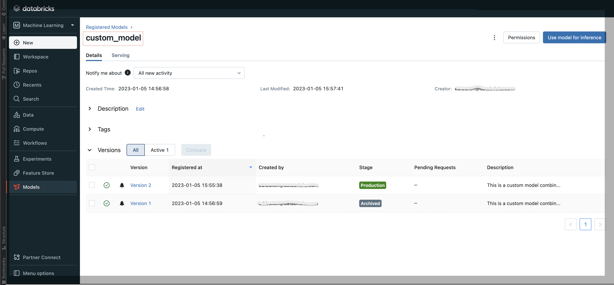

# Packaging Python code in MLflow on Databricks

MLflow is typically used for deploying machine learning models developed using frameworks such as Scikit-learn or Tensorflow.  
  
MLflow can also be used to package up custom functions written in Python and deploy them in the same MLflow framework.
This makes it convenient to deploy and track parameterised versions of custom functions in MLflow on a Databricks platform and execute these against data in a Databricks cluster via the model's `predict()` interface .  

The approach demonstrated here is to use the `mlflow.pyfunc.PythonModel` class to wrap a custom Python class called `HybridFunction` with a method `_custom_function()` containing the custom logic and accessed via the MLflow model `predict()` method.


## Mlflow Deployment

The MLflow API allows a model based on Python code sourced from a Git repo to be deployed into the Databricks Lakehouse platform. 
Different versions of model can be tracked and managed for release into "Production" in MLflow. 
Artefacts and metrics are associated with each version of a model.

Once the model has been deployed it is easily accessible by other processes and users in the Databricks environment by referencing the model's namespace URI.

```
                      stage or version
         model name     |
            |           |
"models:/custom_model/Production"
```



Two Databricks notebooks are provided in this Repo, demonstrating how the custom hybrid model can be deployed and used in a Databricks MLflow environment.

+ `notebooks/hybrid_function_deploy.py`  
+ `notebooks/hybrid_function_run.py`  

The second notebook shows how a model can be loaded:
```python
loaded_model = mlflow.pyfunc.load_model("models:/custom_model/Production")
```
then used to generate predictions (custom function results) against a Pandas dataframe:
```python
loaded_model.predict(df)
```
or registered as a Spark UDF to allow predictions / model results to be extracted from a data-set accessed via SQL on the Databricks platform:
```python
custom_model_udf = mlflow.pyfunc.spark_udf(spark, "models:/custom_model/Production")
spark.udf.register("custom_model_udf", custom_model_udf)

%sql 
SELECT `input_col`, custom_model_udf(`input_col`) as prediction
FROM data_table;
```


## Code

The class definition for loading the model code into MLflow is in `hybridfunction/hybridfunction.py`.  

This is a standard Python function written to follow the [mlflow.pyfunc.PythonModel](https://mlflow.org/docs/latest/python_api/mlflow.pyfunc.html#mlflow.pyfunc.PythonModel) specification with the following structure:

```python
class HybridFunction(mlflow.pyfunc.PythonModel):
    """subclass the PythonModel class"""
    
    def __init__(self):
        """intialise the class instance and define attributes"""
        
        <set attrs>

    def _custom_function(self, model_input :pd.DataFrame):
        """custom code is placed here"""
        
        <custom model code here>
        
        return model_output

    def predict(self, context, model_input :pd.DataFrame):
        """create a predict() method for MLflow to use - calls the custom fn to get results"""
        
        return model_input.apply(self._custom_function)
```

Tests for the custom function code are in `tests/test_function.py`.  

The tests demonstrate how the function works and also illustrate how the model code can be developed and tested independently of any MLflow or Databricks environment (no notebooks required).  The Git integration in the Databricks notebook environment make it easy to manage the deployment lifecycyle and bring tested versions of the  code into the MLflow deployment lifecycle.


## Example Hybrid Function

A hypothetical model-function is provided to illustrate the use-case.

a Hybrid Function or [Piecewise Function](https://en.wikipedia.org/wiki/Piecewise) is implemented that combines two different functions depending on the value of x (the domain).  

+ When x < x0, y is a constant value y0
+ When x >= x0, y is uniform gradient function, y = gradient*x + c  (c is the intercept)


This simple concept can be extended to encompass complex business rules or models that are not catered for by the usual machine learning frameworks.  
  
The intention is to show how bespoke business logic can be coded independently in Python and then packaged and deployed for use against business data in the MLflow framework.

The Databricks notebooks in this Repo show using this model applied to the [wine data-set](https://archive.ics.uci.edu/ml/datasets/wine).   It doesn't serve any useful purpose other than demonstrate applying a custom function against a data-set.


## Build and Deploy Wheel for MLFlow Serving

Ref docs:


https://docs.databricks.com/machine-learning/model-inference/serverless/private-libraries-serverless-model-serving.html

https://www.mlflow.org/docs/latest/python_api/mlflow.pyfunc.html#mlflow.pyfunc.log_model

### Part 1 - build wheel and upload to Cluster

+ pip install --upgrade pip
+ Configure `setup.py`  
+ build wheel: `python setup.py sdist bdist_wheel`  
+ Upload this wheel (`./dist/hybridfunction-1.0.1-py3-none-any.whl`) to the Databricks Cluster  
+ Install the wheel in the cluster AND note (copy) the DBFS path to the wheel - this is noted on the Cluster Libraries admin page


**Initialise Class**:  
```python
model = HybridFunction.HybridFunction(x0=5, y0=2, gradient=1)
```

### Part 2 - get the wheel path and link it to MLflow

From the Cluster librares admin page, note the DBFS path to the installed wheel for `hybridfunction`
EG:
```
dbfs:/FileStore/jars/9c8d55d6_8aa5_41ad_984d_f615bae87535/hybridfunction-1.0-py3-none-any.whl
```
Change this path to use a `/` instead of a `:` for the DBFS itentifier:
```
/dbfs/FileStore/jars/9c8d55d6_8aa5_41ad_984d_f615bae87535/hybridfunction-1.0-py3-none-any.whl
```
Use this to log the dependencies when adding the model to the MLflow repository using `mlflow.log`

```python
response = mlflow.pyfunc.log_model("hybridfunction",
                                    python_model= model,
                                    pip_requirements=["/dbfs/FileStore/jars/03855ebe_a9bc_470f_83c9_6c6ed7fc6289/hybridfunction-1.0.1-py3-none-any.whl"]
                              )
```


